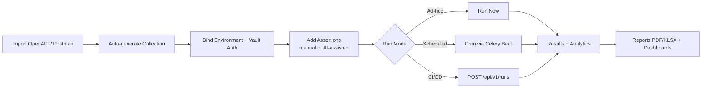

# ZPE API Testing Platform — Confluence Page

> Copy/paste-ready Confluence content. In Confluence, create a new page → **••• → Markup → Markdown**, then paste the content below. Tables, code blocks, and headings convert automatically.

---

## 1. Overview

The **ZPE API Testing Platform** is an internal, enterprise-grade API validation and automation platform built for **ZPE Systems Pvt Ltd**. It consolidates fragmented API-testing workflows (Postman collections, ad-hoc cURL, scattered scripts, multiple mock servers) into a single, governed, auditable web platform used by **QA Engineers, Developers, SREs and DevOps** teams.

**Primary goals**

- Single source of truth for API contracts, environments, credentials and test history.
- Reduce time-to-validate new endpoints from hours to minutes via Swagger/OpenAPI import.
- Replace per-team Postman / cURL silos with a governed, RBAC-controlled workspace.
- Provide AI assistance for assertion authoring, retry logic and test case generation.
- Surface enterprise dashboards: pass/fail trends, reliability scores, slowest APIs.

**Status:** Internal product — © ZPE Systems Pvt Ltd.

---

## 2. Key Capabilities

| # | Capability | Description |
|---|------------|-------------|
| 1 | Swagger / OpenAPI ingest | Upload `.yaml` / `.json`, validate against OpenAPI spec, extract endpoints, parameters, schemas. |
| 2 | Auto-generated artifacts | Export to **Postman**, **cURL**, **Robot Framework**, **Playwright**, **k6**. |
| 3 | Token vault | OAuth2, Bearer, API Key, Basic Auth — encrypted at rest, auto-refresh. |
| 4 | Request execution | Run single requests or full collections with environment overlays. |
| 5 | Assertions engine | Status, headers, JSON schema, contract, custom expressions. |
| 6 | Mock API server | Stateful responses, configurable delays, error injection. |
| 7 | AI assist | Generate assertions, suggest retry/backoff policies, draft new test cases. |
| 8 | Load testing | Starter scripts for **k6** and **JMeter**, executed via Celery workers. |
| 9 | Environments | Dev / QA / Stage / Prod with variable scoping & history. |
| 10 | Dashboards & reports | Pass/fail trends, reliability index, slowest endpoints, PDF/XLSX export. |
| 11 | RBAC & audit | Super Admin, QA Lead, QA Engineer, Developer, Viewer roles + audit logs. |

---

## 3. Architecture

```
┌───────────────┐   HTTPS    ┌──────────────────┐   asyncpg   ┌─────────────┐
│  React + TS   │ ─────────► │  FastAPI Backend │ ──────────► │ PostgreSQL  │
│  Tailwind     │            │  (modular DDD)   │             └─────────────┘
│  shadcn/ui    │ ◄──── WS ─ │  JWT + OAuth2    │   redis://  ┌─────────────┐
└───────────────┘            │  Celery workers  │ ──────────► │   Redis     │
                             └──────────────────┘             └─────────────┘
```

**Runtime services**

| Service   | Image / Build                | Port  | Purpose                                  |
|-----------|------------------------------|-------|------------------------------------------|
| frontend  | `docker/frontend.Dockerfile` | 5173  | React + Vite SPA                         |
| backend   | `docker/backend.Dockerfile`  | 8000  | FastAPI REST + WebSocket API             |
| worker    | `docker/backend.Dockerfile`  | —     | Celery worker (load tests, reports)      |
| postgres  | `postgres:16-alpine`         | 5432  | Primary datastore                        |
| redis     | `redis:7-alpine`             | 6379  | Cache + Celery broker/result backend     |

---

## 4. Technology Stack

| Layer       | Technology                                                                 |
|-------------|----------------------------------------------------------------------------|
| Frontend    | React 18, TypeScript 5, Vite 5, TailwindCSS 3, shadcn/ui, Zustand, React Query, Axios, Recharts, React Router 6 |
| Backend     | Python 3.11, FastAPI 0.115, Pydantic v2, SQLAlchemy 2 (async), Alembic     |
| Auth        | JWT (PyJWT), OAuth2 (Authlib), bcrypt, Cryptography (Fernet vault)         |
| Data layer  | PostgreSQL 16, Redis 7                                                     |
| Workers     | Celery 5 + Redis broker                                                    |
| Validation  | openapi-spec-validator, jsonschema, PyYAML                                 |
| HTTP / Mock | httpx, faker                                                               |
| Reporting   | reportlab (PDF), openpyxl (Excel)                                          |
| AI          | Pluggable provider (OpenAI / Azure OpenAI / local LLM)                     |
| DevOps      | Docker, Docker Compose, GitHub Actions                                     |
| Testing     | pytest, pytest-asyncio, vitest                                             |

---

## 5. Repository Layout

```
APIDashboard/
├── backend/                FastAPI service (modular DDD)
│   ├── app/
│   │   ├── api/v1/         REST endpoints (auth, collections, runs, mocks, …)
│   │   ├── core/           config, logging, security, errors
│   │   ├── db/             SQLAlchemy session & base
│   │   ├── modules/        Domain modules (see §6)
│   │   └── workers/        Celery app
│   ├── alembic/            DB migrations
│   └── tests/              pytest suites
├── frontend/               React + Vite SPA
│   └── src/
│       ├── pages/          Dashboard, Collections, Runs, Mocks, Vault, AIAssist, …
│       ├── components/     Shell, RequireAuth, charts
│       ├── store/          Zustand stores (auth, theme)
│       └── lib/            API client, utilities
├── shared/samples/         Sample OpenAPI specs (petstore)
├── docker/                 Per-service Dockerfiles
└── docker-compose.yml
```

---

## 6. Backend Modules

| Module           | Responsibility                                                      | Path                                  |
|------------------|----------------------------------------------------------------------|---------------------------------------|
| `swagger`        | Parse + validate OpenAPI specs, extract endpoints                    | `backend/app/modules/swagger`         |
| `collections`    | Manage collections, export Postman / cURL / Robot / Playwright / k6  | `backend/app/modules/collections`     |
| `auth_vault`     | Encrypted credential storage, OAuth2 token refresh                   | `backend/app/modules/auth_vault`      |
| `environments`   | Environment variables and scoping                                    | `backend/app/modules/environments`    |
| `validation`     | Assertion engine (status/headers/schema/contract)                    | `backend/app/modules/validation`      |
| `mocks`          | Mock API server with stateful responses                              | `backend/app/modules/mocks`           |
| `loadtest`       | k6 / JMeter script orchestration via Celery                          | `backend/app/modules/loadtest`        |
| `reporting`      | Analytics, PDF & XLSX report generation                              | `backend/app/modules/reporting`       |
| `ai`             | Pluggable LLM provider, assertion & test-case generation             | `backend/app/modules/ai`              |
| `users`          | Users, roles, RBAC enforcement                                       | `backend/app/modules/users`           |

---

## 7. Frontend Pages

| Page              | Path                                  | Purpose                                       |
|-------------------|---------------------------------------|-----------------------------------------------|
| Dashboard         | `frontend/src/pages/Dashboard.tsx`    | Landing KPIs & recent activity                |
| Swagger Upload    | `frontend/src/pages/SwaggerUpload.tsx`| Import OpenAPI specs                          |
| Collections       | `frontend/src/pages/Collections.tsx`  | Browse / edit / export collections            |
| Runs              | `frontend/src/pages/Runs.tsx`         | Trigger runs, view history & results          |
| Mocks             | `frontend/src/pages/Mocks.tsx`        | Configure mock endpoints & behaviours         |
| Vault             | `frontend/src/pages/Vault.tsx`        | Manage credentials & OAuth providers          |
| AI Assist         | `frontend/src/pages/AIAssist.tsx`     | LLM-driven assertion & test generation        |
| Analytics         | `frontend/src/pages/Analytics.tsx`    | Reliability / latency / failure trends        |
| Reports           | `frontend/src/pages/Reports.tsx`      | Generate & download PDF / XLSX reports        |
| Settings          | `frontend/src/pages/Settings.tsx`     | User preferences, env config                  |
| Login             | `frontend/src/pages/Login.tsx`        | JWT auth                                      |

---

## 8. API Automation (Postman-style workflow)

The platform provides a **Postman-equivalent API automation experience** — built natively into the web UI with enterprise governance (RBAC, audit, encrypted vault, AI assist) layered on top. Anything a team does today in Postman can be done here, with the added benefit of shared collections, server-side execution, and CI integration.

### 8.1 Postman → ZPE feature mapping

| Postman concept            | ZPE equivalent                                       | Where in the app                              |
|----------------------------|------------------------------------------------------|-----------------------------------------------|
| Workspace                  | Tenant / team space (RBAC-scoped)                    | Settings → Workspace                          |
| Collection                 | Collection (versioned, server-side)                  | Collections page                              |
| Folder / sub-collection    | Nested groups inside a collection                    | Collections tree view                         |
| Request                    | Request item (method, URL, headers, body, auth)      | Collection → Request editor                   |
| Environment                | Environment (Dev / QA / Stage / Prod) + variables    | Environments selector (top bar)               |
| Global variables           | Global vars per workspace                            | Settings → Variables                          |
| Pre-request script         | Pre-request hook (JS/Python expression)              | Request → "Pre-request" tab                   |
| Tests / `pm.test`          | Declarative assertions + custom expressions          | Request → "Assertions" tab                    |
| Collection Runner          | **Run Now** / scheduled runs                         | Runs page                                     |
| Newman (CLI)               | REST API + GitHub Action / Jenkins step              | `/api/v1/runs` endpoint                       |
| Monitors                   | Scheduled runs (Celery beat)                         | Runs → Schedule                               |
| Mock servers               | Mock API server (stateful, delays, error injection)  | Mocks page                                    |
| Auth helpers (OAuth2 etc.) | Token vault with auto-refresh                        | Vault page                                    |
| Console / logs             | Run detail view with request/response timeline       | Runs → Run detail                             |
| Postman AI                 | AI Assist (assertions, retries, test generation)     | AI Assist page                                |
| Reports / dashboards       | Analytics + Reports (PDF / XLSX)                     | Analytics, Reports pages                      |

### 8.2 Automation building blocks

**a. Collections**
- Tree of folders + requests, versioned in Postgres (history & rollback).
- Import from: Postman v2.1 JSON, OpenAPI 3.x, cURL paste.
- Export to: Postman v2.1, cURL, Robot Framework, Playwright, k6.

**b. Requests**
- Methods: `GET / POST / PUT / PATCH / DELETE / HEAD / OPTIONS`.
- Body types: `raw (json/text/xml)`, `form-data`, `x-www-form-urlencoded`, `binary`, `graphql`.
- Auth (resolved from Vault): `None`, `Bearer`, `Basic`, `API Key (header/query)`, `OAuth2 (AC, CC, Password)`.
- Variable interpolation: `{{baseUrl}}/users/{{userId}}` resolved from env + globals + run params.

**c. Pre-request & test hooks**
- Pre-request: mutate headers/body, fetch tokens, compute signatures.
- Tests (assertions): combinable rules + custom expressions.

```yaml
# Example assertion set (declarative)
- status: 200
- headerEquals: { name: Content-Type, value: application/json }
- jsonPath: { path: $.data.id, exists: true }
- jsonSchema: schemas/user.json
- responseTimeMs: { lt: 800 }
- custom: "response.body.items.length > 0"
```

**d. Environments & variables**
- Scopes (lowest → highest precedence): `global → environment → collection → folder → request → run-time override`.
- Secret variables are vault-backed and never logged in plaintext.

**e. Collection Runner (Runs)**
- Trigger ad-hoc or scheduled (cron) runs against any environment.
- Parallelism, iteration count, data-driven runs from CSV/JSON.
- Per-run artifacts: HAR-style timeline, response bodies, assertion results, screenshots (where applicable).

**f. Mocks**
- Spin up a stateful mock from a collection or OpenAPI spec.
- Inject latency, status codes, error responses for resilience testing.

**g. AI Assist**
- "Generate assertions for this response" → produces a declarative assertion set.
- "Suggest retry policy" → backoff + idempotency hints.
- "Generate negative test cases" → adds requests covering 4xx / boundary inputs.

### 8.3 CI/CD integration

The same collection that runs in the UI can be executed from any CI pipeline via the REST API.

```bash
# Trigger a collection run from CI (GitHub Actions / Jenkins / Azure DevOps)
curl -X POST https://api-platform.zpe.local/api/v1/runs \
  -H "Authorization: Bearer $ZPE_API_TOKEN" \
  -H "Content-Type: application/json" \
  -d '{
        "collectionId": "col_8f2a...",
        "environmentId": "env_qa",
        "iterations": 1,
        "failFast": false,
        "notify": ["slack:#qa-alerts"]
      }'
```

Exit code, JUnit XML, and HTML report URLs are returned for pipeline gating.

### 8.4 Typical automation workflow



### 8.5 Why teams migrate from Postman

- **Centralised governance** — collections live server-side, not in personal accounts.
- **RBAC + audit** — every change and run is attributable and logged.
- **Secure secrets** — credentials never leave the encrypted vault.
- **AI built-in** — assertion & test-case generation without third-party plugins.
- **CI-native** — first-class REST API; no per-seat Newman licensing.
- **One platform** — collections + mocks + load tests + reporting in a single tool.

---

## 9. Roles & Permissions (RBAC)

| Role         | Capabilities                                                                 |
|--------------|------------------------------------------------------------------------------|
| Super Admin  | Full access, user/role management, vault administration, audit log access.   |
| QA Lead      | Manage collections, environments, schedule runs, approve mocks, view all.    |
| QA Engineer  | Author tests, run executions, manage assigned mocks.                         |
| Developer    | Read collections, execute runs against Dev/QA, view results.                 |
| Viewer       | Read-only access to dashboards, reports and history.                         |

All sensitive actions are recorded in the audit log (who / what / when / from where).

---

## 10. Getting Started

### 10.1 Run with Docker (recommended)

```powershell
copy .env.example .env
docker compose up --build
```

| Endpoint   | URL                            |
|------------|--------------------------------|
| Frontend   | http://localhost:5173          |
| Backend    | http://localhost:8000          |
| Swagger UI | http://localhost:8000/docs     |
| Postgres   | localhost:5432 (user: `zpe`)   |
| Redis      | localhost:6379                 |

**Default super admin** (created on first boot):
`admin@zpesystems.com` / `ChangeMe!123` — **rotate immediately on first login.**

### 10.2 Local development (no Docker)

```powershell
# Backend
cd backend
python -m venv .venv; .venv\Scripts\Activate.ps1
pip install -r requirements.txt
uvicorn app.main:app --reload

# Frontend
cd frontend
npm install
npm run dev
```

### 10.3 Tests

```powershell
cd backend; pytest -q
cd frontend; npm test
```

---

## 11. Security Notes

- Credentials in the vault are encrypted at rest using **Fernet (Cryptography)**.
- Passwords are hashed with **bcrypt**.
- JWT tokens are signed using a server-side secret; rotate per environment.
- OAuth2 flows use **Authlib** (Authorization Code + Client Credentials supported).
- All inbound payloads are validated via **Pydantic v2** models.
- OpenAPI imports are validated by **openapi-spec-validator** before persistence.
- RBAC is enforced at the API layer (`app/api/deps.py`).
- Audit logs are written for all privileged mutations.

> Reminder: never commit `.env`, vault keys or production credentials to the repo.

---

## 12. Roadmap (high level)

- SSO (SAML / OIDC) for enterprise IdP integration.
- Scheduled regression suites with Slack / Teams notifications.
- Contract-test diffing across OpenAPI versions.
- Kubernetes Helm chart (currently Docker Compose only).
- Per-team workspaces & quota enforcement.

---

## 13. Ownership & Support

| Area              | Owner                          |
|-------------------|--------------------------------|
| Product           | ZPE QA Platform Team           |
| Backend           | Platform Engineering           |
| Frontend          | Web Engineering                |
| Infra / DevOps    | SRE                            |
| Security review   | InfoSec                        |

For issues, raise a ticket in the internal tracker and tag **#api-platform**.

---

*Last updated: May 29, 2026 — generated from repository state.*
