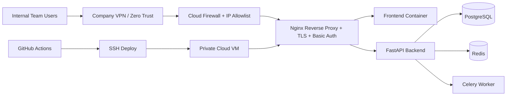

# Internal Deployment Guide (Private Team Access)

## 1) Technology Stack Identified

- Frontend: React 18 + TypeScript + Vite + Tailwind
- Backend: FastAPI (Python 3.11), SQLAlchemy, Alembic, Celery
- Data: PostgreSQL 16, Redis 7
- Runtime: Docker + Docker Compose
- CI/CD: GitHub Actions

## 2) Target Internal-Only Architecture



## 3) Recommended Cost-Effective Hosting

Best balance of cost + control for internal use:

1. Single cloud VM in private network (e.g. Hetzner CX22, AWS t3.small, Azure B2s)
2. Public ingress only through strict IP allowlist (VPN egress IPs / office static IPs)
3. Internal DNS name mapped to VM (example: api-dashboard.internal.company)
4. TLS via company certificate or Let's Encrypt + DNS/HTTP challenge

Why this is cost-effective:
- One VM can run app + DB + Redis for moderate internal usage.
- Minimal managed-service overhead.
- Easy rollback and operations using Docker Compose.

## 4) Files Added

- deploy/internal/docker-compose.prod.yml
- docker/backend.prod.Dockerfile
- docker/frontend.prod.Dockerfile
- deploy/internal/frontend/default.conf
- deploy/internal/nginx/nginx.conf
- deploy/internal/nginx/conf.d/site.conf.template
- deploy/internal/nginx/conf.d/allowlist.conf
- deploy/internal/scripts/deploy.sh
- deploy/internal/scripts/rollback.sh
- deploy/internal/scripts/post-deploy-checks.sh
- deploy/internal/scripts/generate-allowlist.sh
- deploy/internal/scripts/render-nginx-config.sh
- deploy/internal/scripts/provision-letsencrypt.sh
- deploy/internal/scripts/install-company-cert.sh
- deploy/internal/scripts/create-htpasswd.sh
- .env.prod.example
- .github/workflows/internal-deploy.yml

## 5) Infrastructure Setup

### VM baseline

1. Provision Linux VM (Ubuntu 22.04/24.04).
2. Install Docker + Compose plugin + git + curl + gettext-base.
3. Create DNS record for INTERNAL_DOMAIN pointing to VM.
4. Restrict security group/firewall:
   - Allow 443 only from VPN CIDR / office IPs.
   - Allow 80 only for ACME challenge (or keep internal if using company cert).
   - Deny all other inbound.

### Server bootstrap commands

```bash
sudo apt-get update
sudo apt-get install -y docker.io docker-compose-plugin git curl gettext-base
sudo usermod -aG docker $USER
newgrp docker

git clone <your-repo-url> /opt/apidashboard
cd /opt/apidashboard
cp .env.prod.example .env.prod
mkdir -p secrets
```

## 6) Environment and Secrets

Populate .env.prod with strong values:

- APP_SECRET_KEY
- APP_ENCRYPTION_KEY
- POSTGRES_PASSWORD
- BOOTSTRAP_ADMIN_PASSWORD
- ALLOWED_CIDRS
- INTERNAL_DOMAIN
- BACKEND_IMAGE / FRONTEND_IMAGE

Store real values in:

- Server .env.prod (never commit)
- GitHub Secrets for CI/CD (deploy host/user/key/path/domain)

## 7) SSL/TLS Setup

### Option A: Company certificate (recommended for strict internal DNS)

```bash
bash ./deploy/internal/scripts/install-company-cert.sh /path/fullchain.pem /path/privkey.pem
```

### Option B: Let's Encrypt

```bash
bash ./deploy/internal/scripts/provision-letsencrypt.sh
```

Then start cert renewal profile:

```bash
docker compose --env-file .env.prod -f deploy/internal/docker-compose.prod.yml --profile certbot up -d certbot
```

## 8) Access Controls

Defense in depth enabled:

1. Network restriction via ALLOWED_CIDRS -> generated Nginx allowlist.
2. Edge auth with Nginx basic auth (htpasswd).
3. Application auth via existing login/JWT in backend.

Create edge credentials:

```bash
bash ./deploy/internal/scripts/create-htpasswd.sh teamuser 'StrongPasswordHere'
```

Generate Nginx allowlist and config:

```bash
bash ./deploy/internal/scripts/generate-allowlist.sh
bash ./deploy/internal/scripts/render-nginx-config.sh
```

## 9) Deployment Commands

Manual deploy:

```bash
bash ./deploy/internal/scripts/deploy.sh
bash ./deploy/internal/scripts/post-deploy-checks.sh
```

Manual rollback:

```bash
bash ./deploy/internal/scripts/rollback.sh <previous_image_tag>
```

## 10) GitHub Actions CI/CD

Workflow: .github/workflows/internal-deploy.yml

Capabilities:

1. Build backend/frontend production images
2. Push images to GHCR tagged by commit SHA
3. Deploy to VM over SSH
4. Manual rollback to any previous tag

Required GitHub secrets:

- DEPLOY_SSH_HOST
- DEPLOY_SSH_USER
- DEPLOY_SSH_KEY
- DEPLOY_SSH_PORT
- DEPLOY_PATH
- INTERNAL_DOMAIN

## 11) Logging and Monitoring

Included:

- Container log rotation via json-file max-size/max-file
- Nginx access/error logs in named volume
- Docker health checks for frontend/backend/nginx/redis/postgres
- Optional node-exporter profile for host metrics

Start monitoring exporter:

```bash
docker compose --env-file .env.prod -f deploy/internal/docker-compose.prod.yml --profile monitoring up -d node-exporter
```

## 12) Health Check Endpoints

- Edge: /healthz
- Backend: /health and /api/v1/health
- Frontend internal container: /healthz

Validation:

```bash
curl -k https://api-dashboard.internal.company/healthz
curl -k https://api-dashboard.internal.company/api/v1/health
```

## 13) Internal Access Strategy

Recommended policy:

1. Require users to be on company VPN.
2. Firewall only allows VPN CIDR to 443.
3. Keep 22 restricted to admin bastion IPs only.
4. Use Nginx basic auth for quick gate and app login for role-based access.
5. Rotate credentials and secrets quarterly.

## 14) Team Onboarding

1. Connect to VPN.
2. Visit https://api-dashboard.internal.company.
3. Enter Nginx basic auth credentials.
4. Log in with platform account.
5. For new users, admin creates account/role in app.
6. Report access issues to DevOps with source IP and timestamp.

## 15) Security Recommendations

1. Enforce least privilege on VM and repository access.
2. Keep .env.prod and key material outside git.
3. Enable automatic OS security updates.
4. Enable daily DB backups and weekly restore tests.
5. Add fail2ban on SSH and key-only login.
6. Audit container image vulnerabilities in CI.
7. Consider replacing basic auth with IdP (Azure AD / Okta) using oauth2-proxy when ready.
